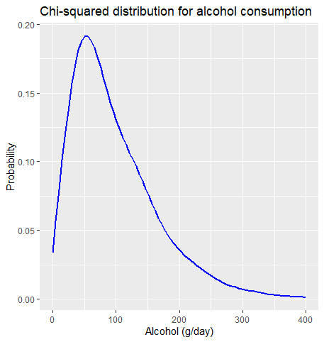

```{r setup, include=FALSE}
knitr::opts_chunk$set(fig.pos = "!H", echo = TRUE)
library(knitr)
# knitr::opts_chunk$set(echo = TRUE)
```

# Dataset manipulation

This section concerns itself with how our team adapted the _cancer_data.csv_ file for our specific needs and how we addressed missing values.

## General changes

Metric variables with digits were rounded to decimal points depending on their values. As height was given in centimeters, we rounded it to full integers. Weight, given in kilograms, was rounded to one decimal point. Cholesterol values were rounded to two digits. 

Gender was renamed to sex and smoking was renamed to smoker.

## Added variables

To adjust the dataset to liver cancer, we added a few variables.
As both patient height and weight were available, we computed Body Mass Index (BMI) for all patients with one decimal point.
When looking at smoking behaviour, packyears is a more powerful measure than a dichotomous variable indicating whether or not a person is currently smoking. Packyears are calculated as the product of years that a person smoked and the cigarette packs they smoke each day. I.e. a person smoking one pack of cigarettes a day for 5 years would have 5 packyears. To compute packyears, we added a variable cigs_per_day describing how many (if any) cigarettes patients smoked each day. This variable can only be realistically measured by asking the patient about it. In such surveys, humans tend to round numbers, which is why the cigarettes per day variable only contains uniformly randomly generated multiples of ten ranging from 0 (for non-smokers) to 60. 
With 20 cigarettes per pack, this means that we have a maximum of 3 packs per day smoked.  
The more difficult part was modeling how long patients had been smoking for. According to the US Centers for Disease Control and Prevention, 9 out of 10 smoking adults first tried smoking by age 18 and 99% first tried smoking by age 26.  
Therefore, we determined that all smoking patients started between ages 16 and 26 or age 16 and the smallest age observed in our study should it be smaller than 26. The smallest age observed in the data coincided to be precisely 26. In this interval, uniformly random values were generated.  
Packyears were then calculated as: 
$$
packyears=\frac{cigs\_per\_day}{20} \cdot (age-age_{started})
$$
Another variable we saw closely related to liver cancer was alcohol consumption. Alcohol abuse can lead to fatty liver disease or liver cirrhosis and thus increase risk for liver cancer. To generate these values, we decided to use a positively skewed distribution in order to simulate rather low alcohol consumption in most patients while still allowing for outliers with high alcohol consumption.
We multiplied random values of a chi-squared distribution with 4 degrees of freedom by 25 to generate values for alcohol consumption.  
Compared to the general population, the generated alcohol consumption values were very high, however we justified these high values by the fact that our sample consists exclusively of patients with liver cancer, a disease for which excessive alcohol consumption is a major risk factor.  
Alcohol consumption in grams per day was saved with the precision of one decimal point.

{width=50%}

As advanced stages of liver cancer are associated with icterus, a yellowish pigmentation of the skin caused by an increase in blood bilirubin levels, we also included bilirubin in our dataset. 
We decided to model bilirubin in dependency of other variables in the dataset, namely cholesterol, tumour size, alcohol consumption and packyears as we saw those variables indicative of liver function. The bilirubin variable in our dataset has two digits.


## Missing values 

In the original data, three cholesterol observations were missing. In order to find accurate replacements, we compared results of BMI-grouped means and kNN imputation.

### BMI-grouped means

For this approach, we added a new variable describing BMI groups. Observations were assigned to one of four classes based on their BMI as follows: 

BMI class | BMI
-- | -- 
1 | $BMI <22$
2 | $22\leq BMI <24$
3 | $24\leq BMI < 26$
4 | $BMI \geq 26$

For observations with missing cholesterol values, we determined their BMI group and imputed the arithmetic mean for cholesterol in that group (over all non-missing observations).
The motivation behind this was that patients with similar BMIs were assumed to have similar cholesterol values as well.  
However, this approach was discarded later on as BMI groups were too large and we feared that mean imputation would not be accurate and would underestimate true variance for such large sample sizes. 

### kNN imputation

As our concerns with the accuracy of the BMI-grouped means approach grew, we started looking for alternative imputation methods based on fewer observations. Our goal was to replace missing values by similar observations in the hope that they would also be similar for cholesterol.
A very common and effective way to replace missing data based on similar observations is the kNN or k-nearest neighbours method.  
This algorithm determines the _k_ closest entries to an observation with missing values and imputes the mean of those nearest neighbours.  
When it comes to choosing _k_, there is no universally optimal solution. Different values for _k_ might be optimal for different datasets.  
In more sophisticated imputations, the existing data can be used to calculate the optimal value for _k_. However, as data imputation was not the main focus of this project, we simply chose _k_ so that neighbour values were similar. Comparing standard deviations of cholesterol for _k_=3,5,7,9 showed that values were most similar for _k_=3, so this was chosen as the number of neighbours to be considered.  
For our kNN approach, we decided that as few as possible variables should be used and that those variables should have a substantial association to cholesterol as to not reduce model accuracy due to noise in the data. Furthermore, we realised that implementing weighing of variables could prove useful.  
The variables we used to find nearest neighbours for cholesterol were:  

 * sex (weight=0.25): distributions of cholesterol differed between sexes
 * age (weight=1): a linear association between age and cholesterol could be found in the data
 * bmi (weight=1.25): the data showed an association between bmi and cholesterol. bmi was assigned additional weight as higher bmi is associated with higher levels of cholesterol in literature
 * size (weight=1): a linear association between size and cholesterol was present in the data

Our implementation was split into two functions, a first one computing distances and a second one returning the _k_ nearest neighbours based on the first function. 

```{r, eval=FALSE}
#' Compute distances from one node in a data frame to all other nodes
#' @param df Data frame
#' @param id Row number of the reference node
#' @param vars A vector specifying variables to be considered (by columns)
#' @param weights A vector specifying weights for the variables
#' @return The distances of specified node to all other nodes
#' @examples
#' distances(df, id=3, vars=c(1,2,3), weights=c(1.25, 2, 1.5))

distances <- function(df, id, vars, weights=rep.int(1,length(vars))) {
  distance_to_id <- numeric(length(df[,1]))
  for(v in vars) {
    for(i in (1:length(distance_to_id))) {
        rng <- range(df[,v])
        distance_to_id[i] = distance_to_id[i] + 
          (abs(df[i,v]-df[id,v])/(rng[2]-rng[1]))*weights[which(vars==v)]
    }
  }
  return(distance_to_id)
}

#' Return IDs of k nearest neighbours for a specified node
#' @param df Data frame
#' @param id Row number of the reference node
#' @param vars A vector specifying variables to be considered (by columns)
#' @param k Number of nearest neighbours to be found
#' @param weights A vector specifying weights for the variables
#' @examples 
#' knn(df, id=3, vars=c(1,2,3), k=3, weights=c(1.25, 2, 1.5))
knn <- function(df, id, vars, k, weights=rep.int(1,length(vars))) {
  distances_to_id <- distances(df, id, vars, weights)
  df_with_distances <- data.frame(cbind(df, distances_to_id), ordered_id=(1:length(distances_to_id)))
  df_with_distances <- filter(df_with_distances, ordered_id !=id)
  df_with_distances <- arrange(df_with_distances, df_with_distances$distances_to_id)
  return(df_with_distances$ordered_id[1:k])
}
```

Imputed values computed from our kNN method are listed below:

ID of NA | Chol neighbour 1 (distance) | Chol neighbour 2 (distance) | Chol neighbour 3 (distance) | 3NN-mean 
--        | --                            | --                        | --                            |-- 
50 | 197.79 (0) | 201.33 (0.048) | 201.03 (0.048) | __200.05__ 
72 | 148.67 (0.184) | 157.83 (0.49) | 158.3 (0.525) | __154.93__ 
182 | 231.35 (0) | 227.75 (0.048) | 228.72 (0.083) | __229.27__ 


To further evaluate our kNN algorithm, we compared it against naive mean imputation on a second dataset. This dataset consisted of 1000 generated observations of patients with variables age, sex, height, weight and blood pressure. Values were generated with weak associations between different variables, i.e. blood pressure being higher for patients with larger values for height or weight.
Roughly 20% of blood pressure values were removed and imputed with the two methods to be compared.
In two separate iterations, both imputation methods were used to predict generated MCAR (missing completely at random) and MNAR (missing not at random) values. Accuracy was evaluated using the RMSE (Root Mean Squared Error) between predicted and actual values saved in a backup vector. 
For both MCAR and MNAR values, our kNN algorithm produced smaller RMSE (1.43 and 1.72 respectively) than naive mean imputation (2.38 and 3.22 respectively). Visually comparing kNN predictions and naive mean predictions to the actual values showed that kNN imputation was also fairly accurate for high and low values while naive mean imputation showed high discrepancy for very high and very low values.  

```{r, echo=FALSE, out.width="50%"}
# upper <- list.files()
include_graphics(path=c("img/knnMCAR.png", "img/meanMCAR.png"))
# lower <- list.files()
include_graphics(path=c("img/knnMNAR.png", "img/meanMNAR.png"))
```


# Sources 

 * https://pubmed.ncbi.nlm.nih.gov/20563664/#:~:text=Prior%20epidemiologic%20studies%20have%20shown,density%20lipoprotein%20cholesterol%20(LDL).
 * https://www.cdc.gov/tobacco/data_statistics/fact_sheets/youth_data/tobacco_use/